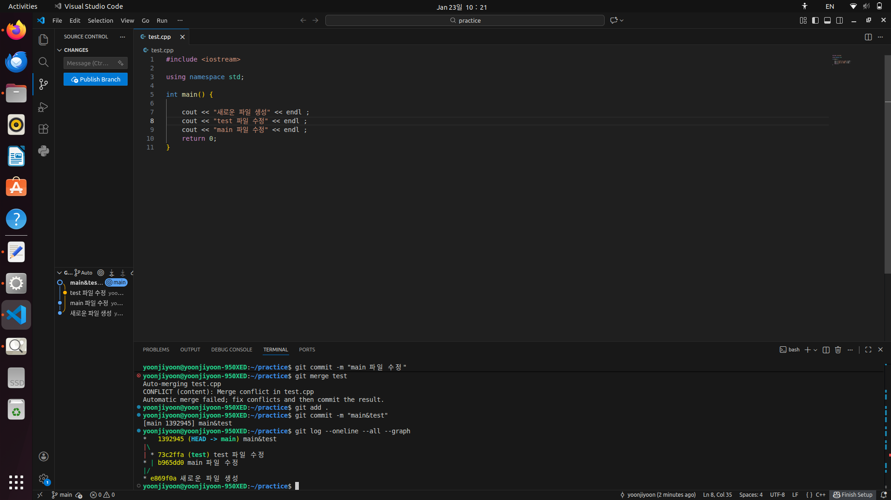

# Practice 답안 - 윤지윤(전기공학과)

---

## 문제 1. 브랜치 분기/병합 및 로그 그래프 캡처
- 

---

## 문제 2. Fork 후 자기소개 문서 제출 및 PR 병합

자기소개
- 이름: 윤지윤
- 학과: 전기공학과
- 관심 분야: ROS2, 자율주행제어
- 하고 싶은 것: 다양한 프로젝트 경험 쌓기

PR 정보
- [#134](https://github.com/EliseEgkart/github_tutorial/pull/134)

## 문제 3. Issue 생성 + PR 승인 후 병합

Issue 정보
- [#135](https://github.com/EliseEgkart/github_tutorial/issues/135)

PR 정보
- [#137](https://github.com/EliseEgkart/github_tutorial/issues/137)